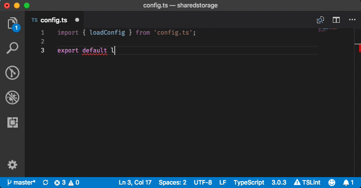
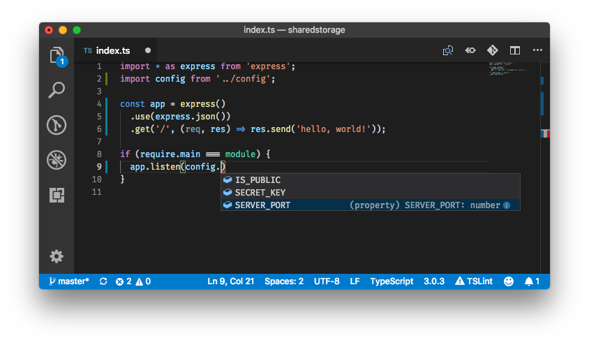
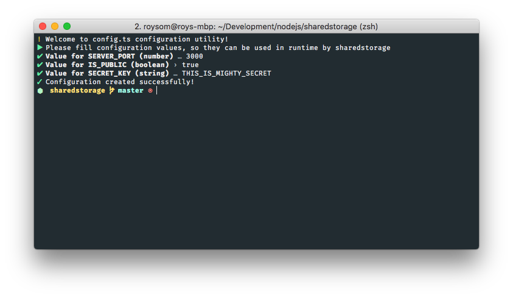

📚 Transparent, typesafe environment configuration



Most of today's configuration systems rely on environment variables, `json` files or other `rc` formats. While usually those methods deliver, they have one problem: since we do not commit config files, their structure and usage are implicit. What guarantee do we have in run time, that `process.env.SERVER_PORT` is set and valid?

**`Config.ts` comes to change that.**

With `Config.ts` you define the template of the configuration file and use it to generate configurations everywhere. `Config.ts` contains these awesome features:

- ✅ Runtime validation of the configuration existence and shape!
- 📐 Fully typed configuration object in your code! (if you use typescript)
- 📝 A cute little CLI to configure your projects when deploying!
- 🦄 Unicorns!

## Quick Start
First, install `Config.ts` using npm:

```bash
npm install config.ts
```

Create a `./config.ts` file in your project root, e.g:

```typescript
import { loadConfig } from 'config.ts';

export default loadConfig({
  SERVER_PORT: 'number',
  IS_PUBLIC: 'boolean',
  SECRET_KEY: 'string'
});
```

Use your configuration everywhere in your code by importing it from the `./config.ts` file:



When deploying, configure using the comfortable `Config.ts` cli, by running ```npx configts```:



This will create a `./.config` file in your project root, which is the actual configuration json file and therefore **should not be committed**, so the last step is to add `.config` to your `.gitignore` file (or any other vcs ignore files);

## The `config.ts` file
The `./config.ts` file is actually the configuration **template**. You define it using the `loadConfig` function. `Config.ts` expects this file to export the loaded configuration as an `export default`, so it can be used both by your code and by the `Config.ts` cli.

### The `loadConfig` function
The `loadConfig` function expects an object which describes the structure of the configuration. The object contains the keys and type of the configuration, where the available types are `string`, `number` or `boolean`.

### Importing `config.ts` file in your code
In order to use the configuration in your code, simply import it from the `./config.ts` file in your project root. The way `loadConfig` is defined will ensure that you get a fully typed configuration object in your code. In runtime, `loadConfig` ensures that a configuration json exists in `./.config`, and that the types match the schema it is defined with, and populates the object it exports with that json.

## Contribution
Suggestions, issue reports and pull requests are always welcome.
